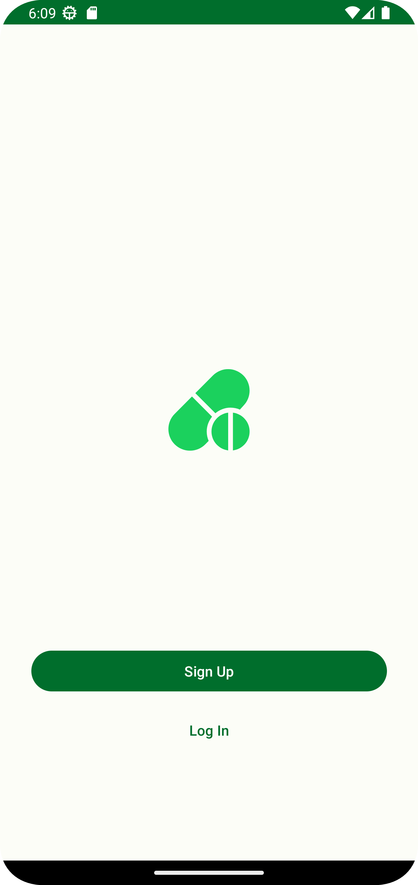
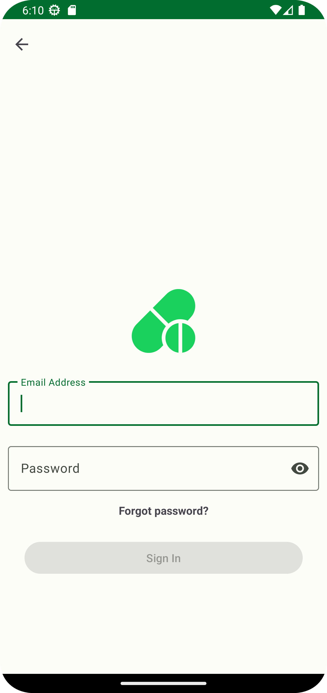
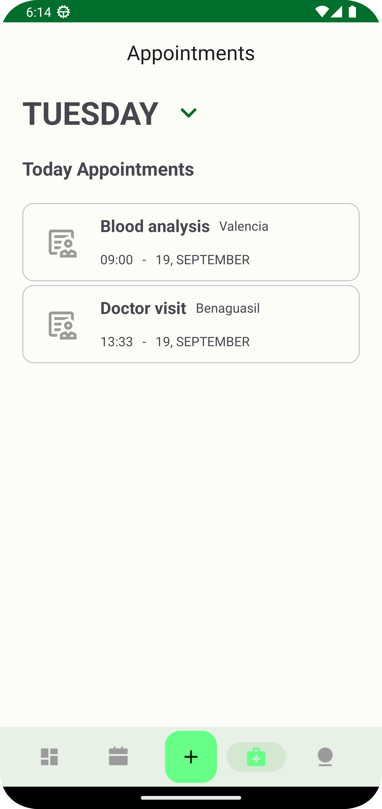
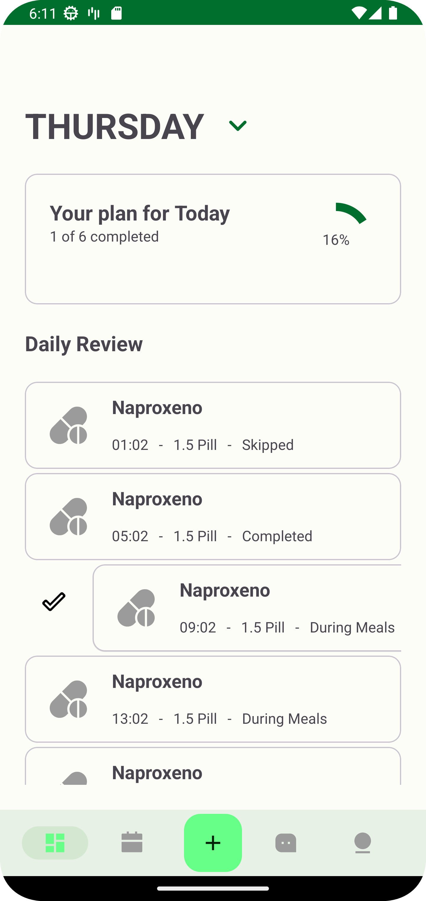
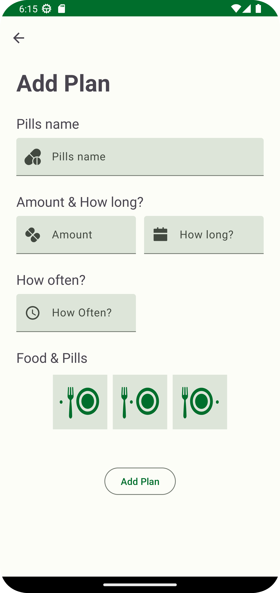
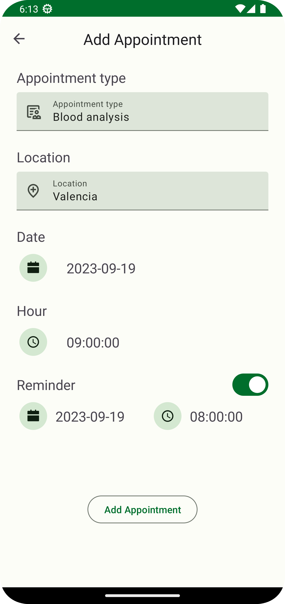

# MedsReminder
App to keep track the taking of your meds.

- Storage and login functions with firebase auth and firestore
- The dependency injection is managed with Hilt
- The app uses Flow with Coroutines to represent the data into the UI.
- Notifications with notification manager and Alarm manager
- Testing with Espresso, mockito, Turbine and Hilt

## Screenshots:

|Login Screen|Sign In Screen|Appointments Screen|
|:---|:---:|---:|
||||

|Dashboard Screen | Add Plan Screen | Add Appointments Screen |
|:---|:---:|---:|
|||| 
